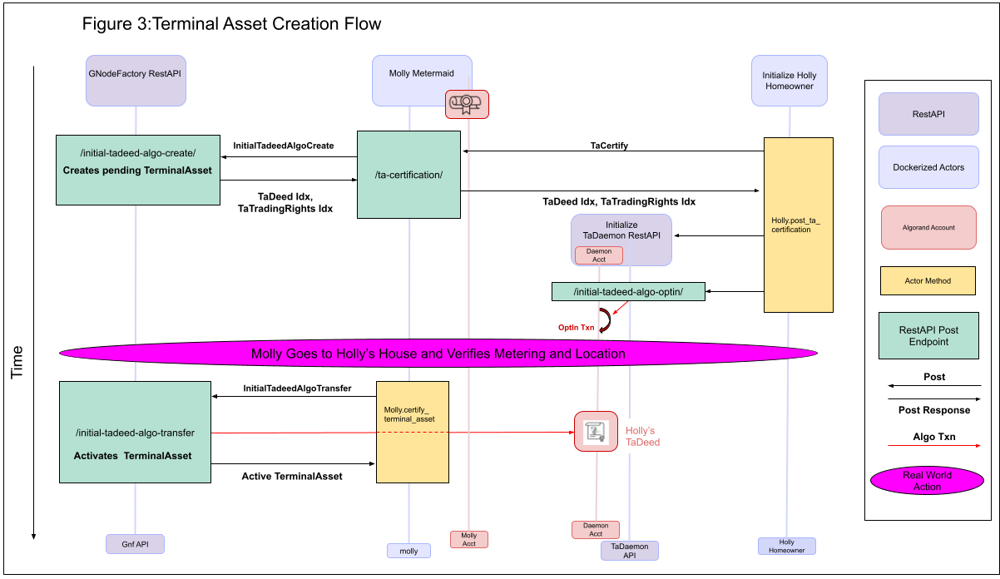

# Design Specifications

Milestone 1 implements two flows:

- the TaValidator Certification Flow; and
- the TerminalAsset Creation Flow (which requires a certified TaValidator).

The flows are combined in `demo.py`, where MollyMetermaid is certified as a TaValidator and the GNodeFactory first creates and then activates the`TerminalAsset` representing HollyHomeowner's heat pump thermal storage heating system.

For the first flow, there are two actors: the GNodeFactory, and MollyMetermaid (who wants to be certified as a Validator for TerminalAssets - that is, she wants to become a [TaValidator](ta-validator.md).

## TaValidaton Certification Flow

Notes.

1. **Misc**
   - For Milestone 1, `demo.py` requires a blank slate to run correctly. In particular, none of the accounts can own any NFTs, and the GNodeFactory cannot have any GNodes yet. To set this up, run `./sandbox reset` from your Algorand sandbox repo, and run `reset-dev-db.sh` from the working directory of this repo (`python_code`).
   - The `gnf.graveyard_account` is not used in Milestone 1. We expect to use it for managing the lifecycle of `TaDeeds`.
1. **Legend**

   - Red arrows represent on-chain transactions called from one of the actors using `algosdk`.
   - Black arrows represent messages that are _not_ sent on-chain. In milestone 2, these messages will be sent via RabbitMq or a FastAPI. For now, they communicate directly within the `demo` script.
   - Red boxes are Algorand accounts.
   - Blue boxes are off-chain python applications. Smart Contracts will get their own color box when they show up.
   - Yellow boxes indicate methods. Typically these are actors either _sending_ or _receiving_ off-chain messages.

1. **Messages**
   - There are two off-chain messages in this flow, both sent _from_ Molly _to_ the GNodeFactory.
   - Molly is implemented in development-only code (`dev_utils/dev_validator.py`). Since her code is a development and testing tool, it is not held to the same standards as the GNodeFactory code. This is why, for example, her actor self-funds on initialization.
   - The payload of the first message is a type of TypeName `create.tavalidator.algo.010` and the second payload is a type of TypeName `transfer.tavalidator.algo.010`.
   - Most of the code in this milestone is embedded in the type validation of messages - which is done by both the sender and the receiver. For example, a `create.tavalidator.algo.010` payload is not valid unless the 2-sig `MultisigAccount` [GNodeFactory.admin_acct.addr, PendingValidator.acct.addr] is appropriately funded (with `nf_validator_funding_threshold_algos`, a value set by the GNodeFactory which in this demo is 100 algos). The payload validations for this message are in `schemata.create-tavalidatorcert_algo`, and `proto_api.json` has a description of all the types and their validations.
1. **Dev Data**

   - One of the axiom governing the creation of GNodes is that, unless the GNodeAlias has only one word (which applies only to the singular root GNode), a GNode's parent must exist before the GNode can be created.
   - This axiom is articulated in `Joint Axiom 1` for the `basegnode.010` type, which can be inspected in the `proto_api.json` specification.
   - In Flow 2 we will be creating a `TerminalAsset` and an `AtomicMeteringNode` for Holly's heater. Before doing that, the GNodeFactory must have already created all of that `AtomicMeteringNode`'s ancestors.

   &nbsp;

   **Figure 2: The ancestors for HollyHomeowner's `TerminalAsset`**

   

   Notes

   - The `demo` calls `load_dev_data`, a script that populates the GNodeFactory's database with the 4 required GNode ancestors shown above.
   - This hack violates the authority of the GNodeFactory by populating the GNodeFactory's database. The process for creating any GNode will require validation by the GNodeFactory, where the type of validation depends on the [Role](g-node-role.md) of the `GNode`. For example, `ConductorTopologyNodes` will require the creation of a [DiscoveryCertificate NFT](discovery-certificate.md), Once this validation process is fully implemented for all roles the hack will be removed and the GNodeFactory will regain authority as the only entity allowed to touch its own database.
   - The root of the tree is _not_ part of the copper. We insist on a single root for the GNode tree (same `Joint Axiom 1` mentioned above), but the GNode tree could instantiate multiple topologically disjoint electric grids. The root node provides the _name_ of what we call the _world_. Worlds whose name start with `d` are dev worlds. A full GridWorks system running on a dev world is expected to be run locally on a developer's computer. The rules for security and data in dev worlds are substantially more lax than other types of worlds (which include `shadow`, `hybrid` and a single `real` world).
   - Note that the `GNodeAlias` for Holly's `TerminalAsset` includes the world `holly`. As a rule, the GNodeAlias for a `TerminalAsset` does not include personal information about the `TaOwner`. What GridWorks generally does in fact is use the name of a random plant - this keeps the alias memorable without attaching personal information. Since holly is a plant, we could not resist the bit of inside baseball for the demo.
   - Note also that the `GNodeAlias` for Holly's `TerminalAsset` has exactly 32 characters. We obviously need to implement `take 2` on assigning a `TerminalAsset`'s `GNodeAlias` immutably to its `TaDeed`. This is in our [office hours list](office-hours.md#better-mechanism-for-branding-gnodealias-into-tadeed) and we'd love advice on how to do it.

   &nbsp;

   ## TerminalAsset Creation Flow

Notes:
-The GNodeFactory database is involved this time. At present, this database is the source of truth for the core attributes of GNodes: their ids, there GNodeAliases, their lifecycle Status, and their CoreGNodeRole. The database also contains pointers to the underlying NFTs, and (in a seperate table) the lat/lon data for the `TerminalAssets`.

- The TaMulti Account is the 2-signature MultisigAccount [GNodeFactory Admin, Daemon Acct, Holly Acct].
- Note that Molly funds the TaMulti, and has it opt into the TaDeed. This means Molly is using Holly's private key (as well as the private key of her TaDaemon). This is not appropriate, and will be transferred to the TaDaemon actor.
- This TaDaemon actor will start as a python application, and is then our first candidate for becoming a smart contract. It will be responsible for creating the `TaTradingRights` NFT for milestone 2. It is also responsible for handling the exchange of an existing TaDeed with a new TaDeed (when, for example, the GNodeAlias changes).

## New Ctn Flow

**Figure 4: New Ctn Flow a**

&nbsp;

**Figure 5: New Ctn Flow B - TaDeed transfer**

