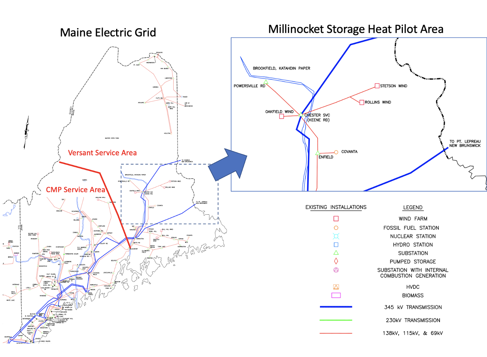

## Discovery Certificates

Discovery Certificates are NFTs intended for use in the process of creating [ConductorTopologyNodes](conductor-topology-node.md), the interior GNodes of the GNodeFactory's [CopperSpanningTree](copper_spanning_tree.md). We care just as much, if not more, about the topological accuracy of `ConductorTopologyNodes` (or `Ctns` for short). However, with the exception of when a `ConductorTopologyNode` changes state by having its role transition from `ConductorTopologyNode` to [MarketMaker](market_maker.md), there is no clear reason for there to be money on the line for the entity/entities involved in the creation of a `Ctn` the way that there is with `TerminalAssets.`

We anticipate working with utilities and gleaning a significant amount of information from them about the location and voltage of various import ConductorTopologyNodes, as well as well-known binding constraints. There is well-known publicly available topology at about the granularity displayed in the picture below:


(From [this](https://www.iso-ne.com/static-assets/documents/2017/10/a6_3_emera_maine_2017_lsp.pdf) ISO NE document about Versant Power Local System Planning)

The mystery is connecting the lat/lon of a house somewhere on this map to the evident `ConductorTopologyNodes` on this graph. This turns into walking or driving down streets and snapping photos of distribution lines, and providing corroborating evidence with online snapshots of maps that include overlays of city streets and 1-line diagrams. Here is an example:


(From [this](https://www.versantpower.com/media/65215/Maps-of-Transmission-Circuits.pdf) Versant Power collection of Transmission Ciruit maps)

The articulation of how `DiscoveryCertificates` will support that activity is still underway. To start, we can convey that the `DiscoveryCertificate` serves as an embelm of recogition for somebody's ehlp in the process of collaboratively constructing the GNodeFactory topology, possibly in some artistic and/or public way. We are not sure how successful that alone will be for motivating people to pull together the supporting materials for a `DiscoveryCertificate`. Other points to consider in the design phase: - There is potentially money on the line for `ConductorTopologyNodes` when they become `MarketMakers.` That transition requires an entity that will own and run a SmartContract brokering local market intereactions, and that entity must provide a third-party validated demonstration of their capability of providing continuous, real-time power flow metering on the constrained edge just above the `Ctn` in question. - It is not appropriate for somebody who has made an accurate first guess at the location of a `Ctn` to have squatter's rights on a future `MarketMaker` market, as maintaining validat MarketMaker status is more rigorous, expensive, technically complicated, laborious and ongoing than the initial `Ctn` creation, which boils down to piecing together old maps and charts, doing some physical checking and taking of photos, and compiling it into a document that another person could use to determine if they agreed with the topological inference). - However, we could consider

## Axioms regulating CertificateDiscovery

As a first step, we are allowing a `Discoverer` to send a `CreateDiscoverycertAlgo` message to the GNodeFactory. To start, for practical purposes the GNodeFactory will just say `yes` to any well-formed request. We require this permissive initial response so we can get off the ground and recursively growing the CopperSpanningTree for dev and testing.

The big question in my mind right now is what checks we want to put in place going forward between the request from a `Discoverer` and the issuing of the deed. The purpose is to put in place an incentive structure that generally leads towards a more accurate and larger SpanningCopperTree. Some initial thoughts: - The parent of the new Ctn its direct descendants, and the Algo addresses that own those `DiscoveryCerts` are obvious interested parties who also might be able to sanity-check the SupportingMaterials. - The consequences for the children and their descendants are greater, since there is likely an `upstream constraint` identified by this new Ctn that those children can either ignore or must respect. In addition, their aliases will all change. - There may be additional interested parties (say a group of enthusiasts who like to provide DiscoveryCertificates in this county, or the local utility) - Perhaps send out a PendingCtn notice to an `InterestedParties` list (that starts out as parent and children and has room for growth) with a period for public commentary? - And then designing am arbitration process that can occur at the end of the public commentary period but also in the future, if another party unearths data suggesting inaccuracy in the original data.

```
"TypeName": "create.discoverycert.algo.000"
    "GNodeAlias":
    "DiscoveryAddr":
    "SupportingMaterialHash":
    "OldChildAliasList":
    "MicroLat":
    "MocroLon":
    "CoreGNodeRole":

```

TODO: Think through how to set up code generation tools for automated documentation of the api-style descriptions of the `CreateDiscoveryCertAlgo`, its attributes and their formatting requirements, and the list of additional semantic checks in axiom format.
