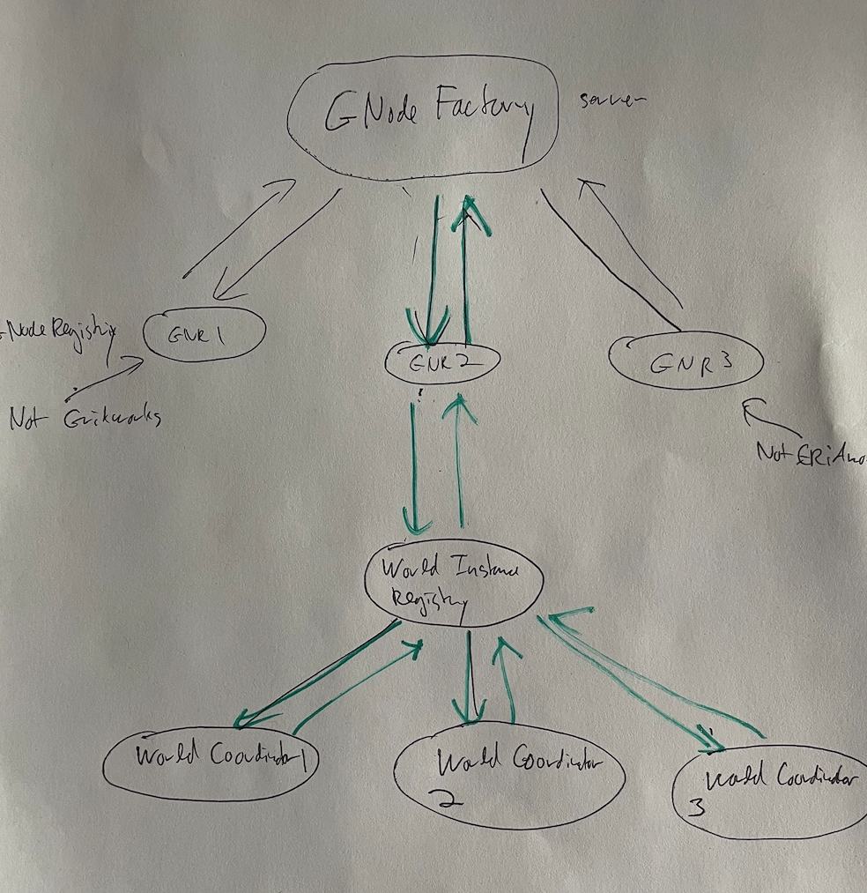
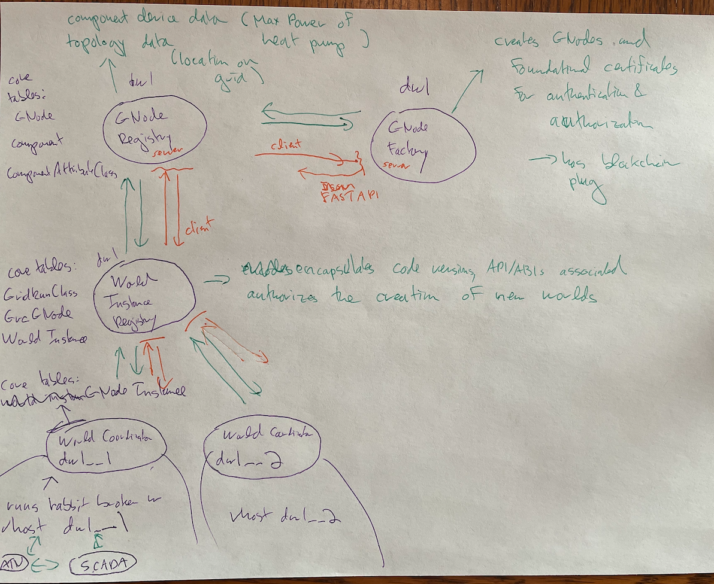
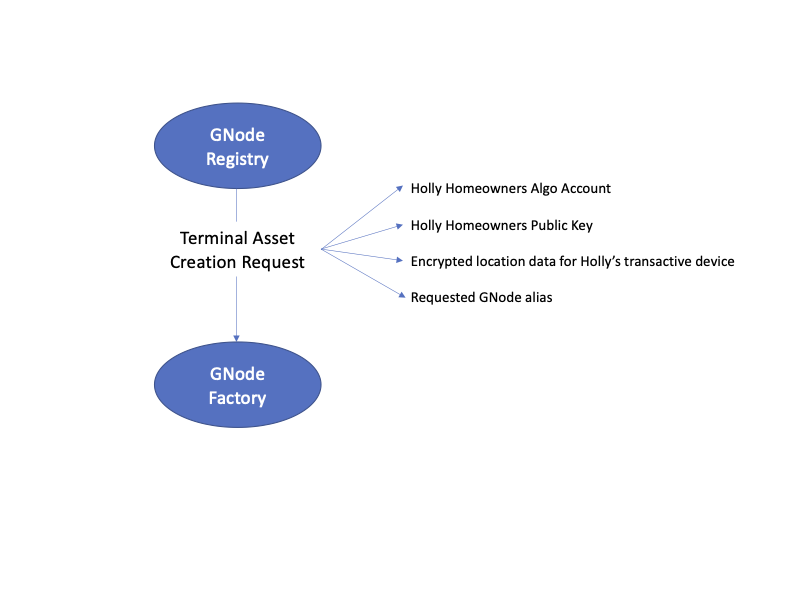
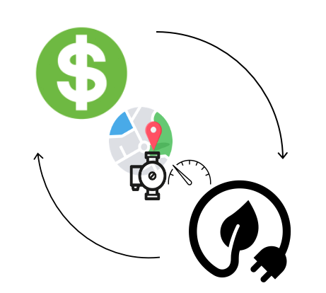

# GNode Factory System Architecture

The GNodeFactory sits inside an ecosystem of managing the relational data of the GridWorks
operations. In fact it sits at the `top` of a set of 4 registry-type services

The only entities that the GNodeFactory communicates with are `GNodeRegistries` and, for
development purposes, `GridworksDevs` (likely via command line tools)

## What it takes for the GNode Factory to create a new TerminalAsset

GNode's come in flavors called GNodeRoles. For most flavors the factory will create
a new GNode on request from the GNodeRegisty as long as basic consinstency axioms are met:

- GNodeId, GNodeAlias and GNodeRole have correct format
- The immutable identifier `GNodeId` is not already taken by another GNode
- The structured mutable identifier `GNodeAlias` has never been used by
  another GNode
- The parent `GNode` exists (as encoded by the `left-right-dot` GNode Alias)

However, for `TerminalAssets` (that is a GNode whose GNodeRole is `TerminalAsset`) the
factory sets a higher bar. It will not issue a new GNode until it can do the following:

1. Give Polly President a reason to trust that the location of Holly Homeowner's heating system (with its revenue grade metering system) is accurately represented on the topology of the electric grid;
2. Update its known topology of the electric grid to include this new leaf node; and
3. Maintain a growing sub-graph of the electric grid that is trusted to be accurate by all concerned parties, and that protects the privacy of homeowners by only sharing their location with parties that have their consent (Molly Metermaid in the case of Holly Homeowner)

The GNode Factory gets messages from the [GNode Registry](https://github.com/thegridelectric/g-node-registry). The GNode Registry is responsible (at present) for validating the quality of the meter and the electrical characteristics of the load. It then passes on a request for creating a new `TerminalAsset` GNode to the GNodeFactory:

Note that Holly's public key getting passed in this request is meant to allow additional security-related data that requires the homeowners signature, as related to this TerminalAsset, to be used off-chain. For example, the GNodeRegistry may have a collection of artifacts that it uses to validate the metering and device characteristics (like pictures, metering data, make/model of the device) and this could be encrypted and signed by Holly.

The opcode fees incurred by the GNodeFactory in creating the NFTs (and later, in any changes made to local state of the GNode/encrypted location pair when the Factory is a stateful smart contract) will be charged to Holly's taOwnerAccount.

The requested GNodeAlias will have a format like `w.isone.vinalhaven.apple`. In order for this GNode to be created, the parent GNode (in this case `w.isone.vinalhaven`) must exist.

If it does not exist, the GNodeFactory sends an error message back to the registry explaining this.

Otherwise, as long as Holly's account is in good standing, the `GNodeFactory` reserves the alias and waits for a message from the GNodeRegistry with the Trusted Validator's attestation.

Once that second message comes through from the GNodeRegistry with Molly's attestion that she has validated the electrical characteristics of Holly's device that Polly cares about, its metering, its location and Holly's ownership, the GNodeFactory creates two NFTs.

The first, and most foundational, is Holly's TerminalAsset Deed NFT. This is the NFT which establish's that Holly owns the Terminal Asset.

Holly will be expected to hold onto this NFT unless she sells her house, at which point the NFT for her heating system could be either destroyed or transferred to the new owner.

The second, and more functional, is Holly's TerminalAsset Trading Rights NFT.

Holly does not expect to be sitting next to her heater, watching energy prices, and manually deciding when to charge her thermal store. Instead, she will enter into a contract with an organization that has a software agent that can make those decisions for her heater. That agent - another GNode, this time called an `AtomicTNode` - will require the Trading Rights NFT in order to place orders and enter into market contracts for buying electricity.

## Why are we focusing on the topology

The electric grid is a somewhat hierarchical graph. To a first approximation, most of the constraints on power flow happen at places where voltage changes. The graph is pretty well instrumented and modeled at the high-voltage levels, where the grid operators operate the lines and run markets (think of the markets as the grid operator's first and best tool for grid operation). However, the graph at the lower voltages is not very well mapped out. Distribution utilities own and maintain these lines. Some of these utilities have decent 1-line diagrams of their lines but most are partial, only in paper-based records, or both. When these lines were designed, it was with the assumption that load ignored the electric grid and that a healthy dose of the central limit theorem could be applied. Also, of course, the lines were not designed to serve all-electric households.

Why go to the trouble of keeping careful track of the transactive asset's location on the topology? In fact, until Transactive Energy becomes a serious industry, none of the incumbent organizations (grid operators, distribution utilities, energy suppliers) will care about the exact location on the network. Often, all that demand response companies care about is what grid operator territory their load is in, or perhaps what utility is serving their load.

In addition, the other attributes of the TerminalAsset - metering quality and electrical charecteristics - **are** of immediate concern to the various existing potential energy transaction counterparties. So why are we focused on a hard problem that nobody cares about?

The answer is that topology will matter almost exactly when blockchain has the potential to make a real difference to electricity markets. While transactive energy is an emerging technology, the incumbent transaction counterparties will be fine with a centralized trusted authority that is essentially a benevolent dictator handling all aspects of the transactive energy ecosystem. (Note: it _could_ be the case that a multi-party ecosystem emerges organically. But transactive energy is hard to get right, and it is likely that some organization will get most of the pieces right first. This organization will not only run the centralized registry handling information authentication, but also the trading strategies for the individual terminal asset _and_ the intermediate market structures.)

However, this trust in running a 1 MW science experiment is very different than the trust required of an organization managing a 1 GW aggregated load asset capable of going from no load to full load in several seconds in response to a price drop (which is what could happen if, for example, Maine were to meet its legislative mandate of installing 100,000 heat pumps with transactive heat pump thermal storage systems).

In other words, transactive energy has the potential to change rapidly from a small science experiment to a powerful grid asset that has the potential to wreak havoc. This wreaking of havoc could occur at all voltage levels but is especially troubling at low voltage, where the system has not been well mapped.

To give a concrete example of what we are talking about, imagine there is a cul-de-sac where all the people living there have gone all-in on this premise. They have converted their gas and oil space and hot water heating to heat pumps coupled with thermal stores. They've traded their gas vehicles for EVs. And all these new electrical appliances are paying attention to the wholesale price of electricity and doing their very best to buy in the lowest-cost wholesale hours (which is in fact entirely aligned with using low-carbon electricity.)

In this scenario, the local low-voltage lines and transformers serving this the cul-de-sac are very likely to catch fire.

So in order to make a real difference, transactive energy needs to do two things:

1. It has to be prepared for serious decentralization of authority, and
2. It has to focus on the hard problem of grid topology out of the gate, and not when it becomes a burning problem.

This is why we are designing a stateful smart contract to capture the evolving picture of the grid topology as our transactive asset grows.

# What does this have to do with [algoship](https://github.com/jasonpaulos/algoship)

As new transactive load is built in houses, it needs to be participatory in discovering the unknown topological structure while maintaining privacy about the location of its homeowner.

This is a game of battleship.
