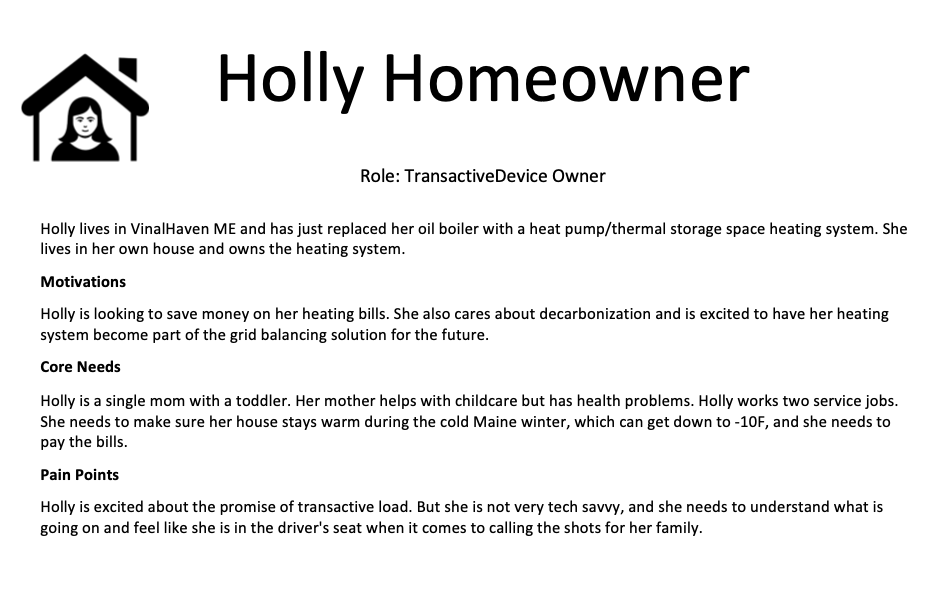
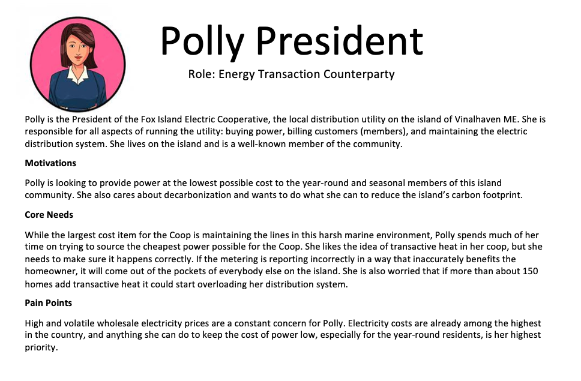
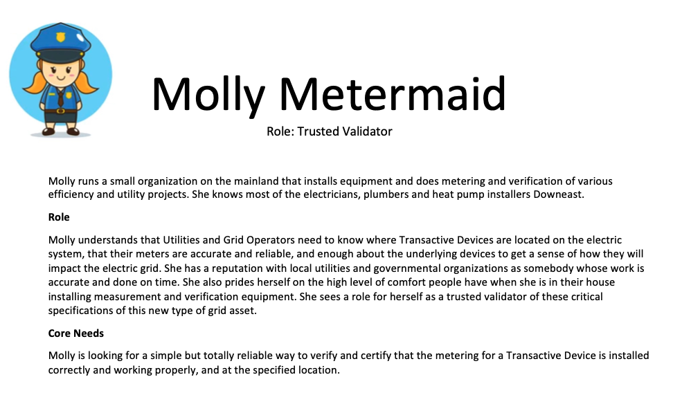
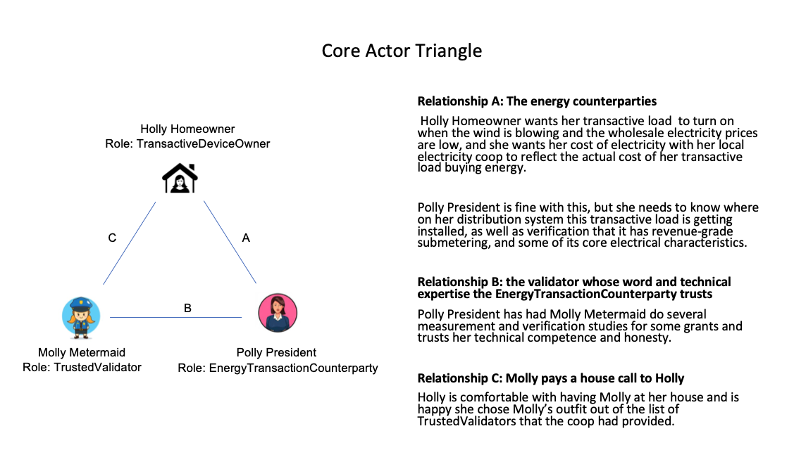
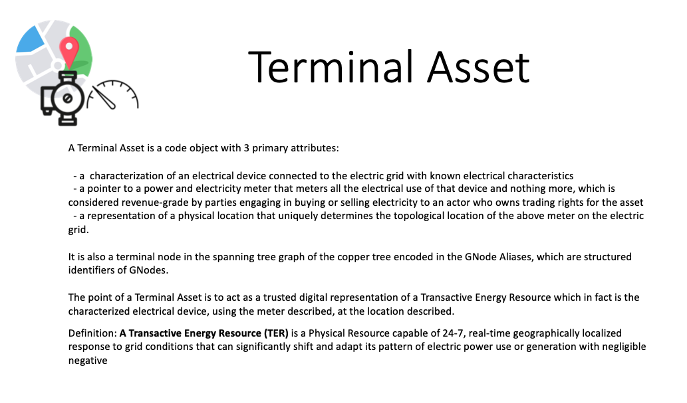

# Initial Design Considerations

This repo is the major deliverable for the first milestone of `Putting the GNode Registry on Chain` for our Algorand `Redefining Demand Response` project.

The core team working on this milestone includes Jessica Millar of [GridWorks](https://gridworks-consulting.com/who-we-are) along with Karl Knaub and Bill Bradley of [Mirabolic](https://www.mirabolic.net/about). Andrew Schweitzer, Karan Nayan and George Baker also contributed.

As we began the design process, our initial and constant focus was on the question: what do we need to do in order to make sure the model of transactive load in our platform is accurately representing reality, and how do we make sure all the relevant actors trust this?

The design phase was an exercise in making things as simple as possible while still doing something critical and innovative. We realized, for example, that the existing registry structure embedded in the highly complex Gridworks platform was way too complicated to be easily understood. It also contained information - like the storage capability of different types of thermal stores, the various makes and models of circulator pumps, radiators and baseboards used for hydronic heat distribution, and the startup seconds of compressors - necessary for doing a good job in creating heat pump bidding strategies and handling backoffice device and equipment management etc but not for creating the foundation of counterparty trust between Holly Homeowner and Polly President (see below).

We realised that there was a core triangle of relationships that would be showing up over and over again. Here are template `actor artifacts` representing the entities in these relationships:

Each of the three pairwise relationships are critical to understand and serve:

Eventually we boiled down to the three core attributes of a terminal asset that we needed to address in order to provide a foundation for the energy transaction between Holly and Polly, facilitated by Molly:

Of these three attributes - metering, key electrical attributes of the physical device, and location - we whittled the focus down to what we believe is the single most unique and challenging feature: validating physical and graph location of nodes. We describe the main reason for this in our [architecture document](gnf-system-architecture.md).

## Work done to date

- Test-driving various algorand demos, reading the docs, trying out pyteal and its sdks, looking a bit at teal
- Thinking through what it really meant to `put the GNode Registry on chain` (above)
- Taking the GNode Registry out of the gridworks platform repo and drastically pruning it
  - Making sure the docker images still build correctly
  - Beginning the test suite
- Beginning the design process for this repository
  - Creating the beginnings of the wiki documentation, which will be the main structure where we will embed documentation, tutorials and artifacts.

## Thoughts and questions

**Death and change**

`TerminalAssets` lifecycle goes from `Pending` to `Active` to `Deactivated`. In order for an entity to actively trade using the trading rights for a `TerminalAsset`, the `TerminalAsset` must be `Active`. And once a `TerminalAsset` is deactivated, it will remain deactivated at all times in the future.

Certain attributes of an `TerminalAsset` can change without changing the state of the `TerminalAsset` to `Deactivated`. For example, the underlying device could break and be replaced with another device of the same make and model and this does not change the identity or lifecycle state of the `TerminalAsset`. On the other hand, if a 10 kW heating system is replaced by a 100 kW diesel generator, it will no longer be the same `TerminalAsset` - the original `TerminalAsset` is `deactivated` and a new one at that location must be created.

The lifecycle state and axioms described above are handled off-chain for the most part, in the `GNodeRegistry`. However, there are consequences for the `GNodeFactory` with its focus on location and issuing NFTs. In particular, whatever system we use (GPS with error bar, address) their will be cases - for example initial mistakes - where we want to change the location data without changing the state of the `TerminalAsset` to deactivated.

To handle this, we need to do one of three things:

1. Store the encrypted, hashed location information in a mutable field for the NFT so that in the above scenario it can be _changed_;
2. Store the encrypted, hashed location information in the _transaction note_ instead of the NFT itself; or
3. Create a lifecycle for the NFTs, so that they can be pulled out of circulation in order to maintain a unique deed and trading right NFT per active `TerminalAsset`.

I believe the third path is what people call _burning_ NFTs, and would require setting up an escrow account which acts as a graveyard for NFTs and setting up some clawback mechanisms. This is my current inclination. In fact, we may choose to expand this this re-issuing of the `NFT` beyond a forced change of the hashed location data to _any_ attribute changes in the GNodeRegistry. This allows the `NFT` trading rights token itself to be a signal that the account trading on behalf of the `TerminalAsset` ought to refresh its data from the `GNodeRegistry` in case anything has changed that might update its trading strategy.

In this case, if any registry data is changed about a `TerminalAsset` (location or otherwise) where the `TerminalAsset` state remains `Active`, the original `NFT` is burned and a new one is issued. This would allow the immutable `MetaDataHash` to store the naked GNodeId/Alias data and encrypted location information. This path would also allow us to pull NFTs out of circulation once the `TerminalAsset` is deactivated - which is not strictly necessary the way it is necessary to not have _two_ NFTs for the same TerminalAsset, but will be cleaner.

However, we have also experimented with 1) above, repurposing the `ReserveAddr` using the algosdk.encoding along with a `shake_256` hash for an input string. This works, but we are not sure we want to be repurposing attributes (although it does not seem to us that ReserveAddr would ever be used for an NFT?).

We have not fully thought through the pros and cons of storing the the location information in transactions instead of the NFT itself.

**Protecting privacy in the case of sequential NFT creation**

Imagine a scenario where Molly Metermaid is doing a series of authorizations sequentially along a street. This could turn into a series of sequential, rapidly created NFTs. If I know that my NFT was created immediately after my neighbor's NFT, this could make it easier for me to guess the connection between my neighbor and her NFT. The `GNodeFactory` should probably take some steps to protect against this. To start, it can batch its NFT requests over time (say, every 48 hours) and then randomize the creation of the NFTs in that batch.

**More on trading rights**

When GridWorks was a start-up called VCharge, we had a service level agreement with homeowners. We installed our SCADA (controls and metering) on their their electric thermal storage heaters at no cost to them, guaranteed them a level of performance of their heating system (basically, their thermostats would work well) and sent them a rebate check once a month for 25% of the electrical energy they used for heat. In return, they signed up with us as their energy supplier, and we offered them the flat (i.e. uniform cost per kWh) standard offer rate (i.e., the default rate from the provider of last resort) for electricity. We chose when they consumed electrical energy, and were rewarded in the wholesale energy markets run by the mid-Atlantic grid operator PJM for choosing to buy electricity when it was low-cost.

In addition to buying energy on the hourly wholesale electrical energy market, we also had trading rights for these `TerminalAssets` in the PJM [Regulation market](https://learn.pjm.com/three-priorities/buying-and-selling-energy/ancillary-services-market/regulation-market) - one of the fast dispatch ancillary service markets run by the PJM.

Fundamentally, we had a `Service Level Agreement` contract where a number of things were exchanged, including most importantly us getting the `TradingRights` for their NFT. These `TradingRights` meant that we bore the financial consequences of when the device consumed or created electricity, and bore both the responsibiity and authorization to bid into markets, when applicable (in this case, for the ancillary services). In order for this to be a sane transaction on our part, it also meant that we (or, really, our code) had decision rights over when they heating systems consumed or created electricity.

The trading rights for the energy market representation and the regulation market representation in the above example were handled very differently. The energy market case was handled by the local regulations and processes at the State level for managing how people change energy suppliers. At the end of the day, most of this involved internal billing and accounting (and a somewhat turgid API) managed by the local utility PPL, which handled all the household metering and billing. The ancillary service market trading rates involved filling in a spreadsheet with the addresses of all of our TerminalAssets, sharing it with PJM and keeping it up to date when it changed by more than a couple hundred kW.

We do not anticipate that the `TradingRights` NFT we create here will be immediately adopted by grid operators or utilities. Rather, these `TradingRights` will belong to `AtomicTNodes` or to `AggregatedTNodes` (`T` for `Transactive`). These will be code actors that trade on internal GridWorks market platforms. These platforms need to respect and integrate into various upstream markets.

**Servicing the Trading Rights**

One important question to ask is how and when a `TradingRights` NFT can be sold or traded. Will it be a like a mortgage, where the homeowner does not have decision rights over who exactly holds their mortgage? Should the `TradingRight` NFT be bundled with its Service Level Agreement (SLA) terms and conditions so that anybody buying the `TradingRights` must take on the responsibility of honoring the Service Level Agreement? And, in particular, the homeowner can invoke the clawback if the SLA is violated?

Thinking through the answers to these questions is still a work in progress. However, one likely similarity with the mortgage industry is the utility of the concept of _servicing_ a `TradingRights` NFT and its assocaited Service Level Agreement. When a mortgage is created, it is immediately split into two parts. The large part is most of the Principle and Interest. A tiny sliver (a few basis points) goes to `mortgage servicing`, which handles billing and reporting (for example, the letter to a homeowner letting them know that a new entity holds the P&I, but nothing will change about how they pay their bills etc).

VCharge had this servicing component of course as well. It consisted of writing rebate checks and sending them out along with a letter of explanation each month to the people with whom we had Service Level Agreements. This function was administrative in nature, very different than designing the automated bidding strategies for `AtomicTNodes`, and very important to get right.

**Storing graph structure (partially) in mutable structured identifiers**

The nature of the structured identifiers (GNodeAliases) means that as the GNodeFactory's grid topology evolves, the GNodeAliases change. If we are storing these GNodeAliases in the stateful Factory contract, then an upstream topology change in the spanning tree will incur opcosts to all the downstream assets (paid for by their owners).

We have had a lot of debate about this. The GNode Aliases are used to help enforce adding to the topological knowledge, since before a TerminalAsset can be created it needs to find its existing parent in the existing GNodes. That is, creating a GNode not only validates its physical location but also validates the edge between it and its parent.

In the end, I think this is worth the additional costs of alias changes. However, it is something that could be a problem if fees got too big.

**Why care about location when what really matters is topology?**

Bill and Karl both have had a fair amount of experience with large data sets that have to do with location. Dealing with physical location (addresses, gps, town plots) comes with a certain amount of guaranteed pain.

However, we ended up deciding it was a requirement. Physical addresses are used to map the electric grid - this is how grid operators and utilities identify their systems.

**Adding a GPS chip and NFT to the Maine Demonstration Scada Device**

Since we are building the SCADA systems for the first 5 homes in Maine, we can add a GPS chip, a private key for encryption, and a blockchain account and/or an NFT to the SCADA. This could simplify the process of validating location and revenue-grade metering.

Some comments about this:

1. It is a good idea, and others have done versions of it on other chains. See for example the [OLI meter](https://www.my-oli.com/en/oli-meter-en).
2. It doesn't address the issue of ownership and decision rights.
3. It also does not address the topology validation (i.e. validating the edge connecting the TerminalAsset to its parent in the GNOde spanning tree).
4. We'd like to design a system that will work when the SCADA/metering does not have these capabilities.

**Incentivizing graph structure discovery: beyond Terminal Assets**

We are starting with `TerminalAssets`, but there will be other components of the grid (edges that create loops and internal nodes) that require mapping. We will need to come up with some incentive structure for motivating entities to do this. However, this is a problem for another day.

## Why does this project bring value to the Algorand ecosystem?

As we described in our grant application, we believe that blockchain is likely critical for transactive energy to occur at scale and that transactive energy, particularly transactive _load_, is critical for rapid and cost-effective decarbonization.

The flipside is that this is a project tying blockchain to the physical world (the real-time exchange of energy) in a way that could move rapidly to tremendous scale once a tipping point is reached. This could become a flagship example of blockchain as a utility in a realm having very little to do with the chain itself, the creative arts, or drugs/illicit activities.

Note that some of what makes this project valuable to the Algorand system involves code, work and ideas that are _not_ on chain and are not even part of the grant: including, for example, installing SCADA systems in basements in Maine. We think that blockchain cannot be airbrushed on top of the design of transactive load, and instead must be designed in correctly by asking the questions we have asked above: what is critical, what is foundational, and how does it evolve and scale?
