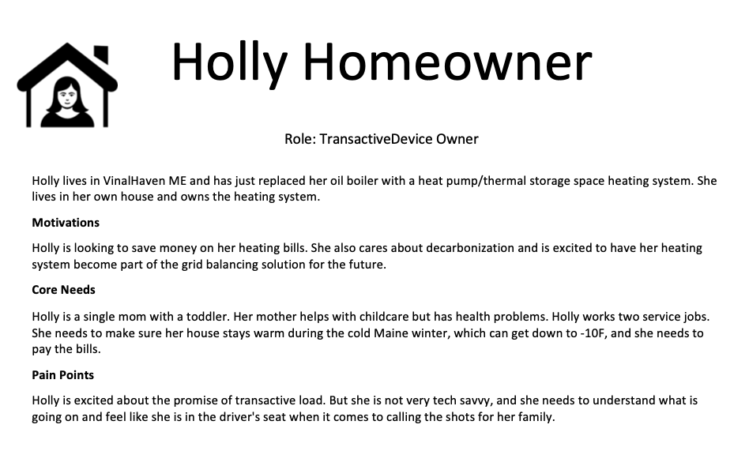

# Project: Redefining Demand Response

**Milestone 1: GNodeRegistry on Chain, Deliverable Summary and Report**

This report is organized according to by the deliverables enumerated in the original SOW for Milestone 1, GNode Registry on Chain:

# Report on Key Papers re Ethereum and Algorand

This report identifies the papers and related technology that will guide our development of the GNodeFactory.

The purpose of the GNodeFactory is to provide a foundation for the GridWorks Transactive Energy Management (TEM) system. The GridWorks TEM system is comprised of a diverse collection of applications that communicate with each other primarily via asynchronous message-passing. The messages shared by these applications are often time-critical, managing real-time operations of physical devices on the electric grid. In addition, these messages often contain significant domain-specific semantics about the physics of the electric grid and the markets we are developing upon which electrical energy and ancillary grid services are exchanged for money. The [reactive manifesto](https://www.reactivemanifesto.org/), which outlines how to build responsive, resilient, elastic, message-driven systems, has been and will continue to be a guiding thought-piece for our system-wide development efforts.

The GNodeFactory as implemented in this milestone and the next may have no smart contracts. It creates NFTs that provide validation for TerminalAssets and certication of trading rights for those assets. We describe what this means in more detail below, but it is essentially another take on Proof of Origin Certifacte NFTs in the electricity sector, likely comparable in function to what [Climatecoin](https://www.climatecoin.io/) has implemented. Even for this relatively straightforward task with examples to draw upon from others, it became clear that we will require a solid plan for preparing for and handling vulnerabilities. The business logic is complicated enough that without a somewhat formal and axiomatic approach, even the Layer 1 part of our application is at risk for both design and code vulnerabilities. This issue will magnify as we begin designing PyTeal contracts.

Given the purpose and nature of the GNodeFactory, we require guiding principles for its development that can help us deliver a formally sound application. Given the message-passing nature of the larger GridWorks system, this starts with ensuring the syntax and semantics of messages passed to and from the GNodeFactory, and internally within sub-systems of the GNodeFactory.

A first step towards mitigating risk includes [design specification](milestone-1-specifications.md), with human readable graphics that capture the logic of message flows.

A second step that we have begun implementing in this Milestone is incorporated in what I will call our `proto-API`. Every message that is sent to or received by our GNodeFactory has a strongly defined type. As implemented now, these `types` are all strings - although as we move closer to implementing ABIs we expect many of the `types` will be bytes. Every `type` has a `TypeName` that is encoded within the message and also expected to be passed in meta-data. The `TypeName` is a pointer towards both how to decode the message payload, and also to a set of validations that must be passed in order for the payload to have that `Type`. These validations, which are enumerated as `axioms`, encapsulate the underlying semantics of the intended business logic for the message. The json `proto-API` specification includes a description of all the fields in the `types`, as well as a description of the `axioms` for each `type`. Finally, there are `schema` for each type that facilitate translation from the `type` to a native python `NamedTuple` (which we select for enforced immutability, which is appropriate for message payloads passed between applications), The `schema` also provides validations for all of the `type`'s `axioms`. These validations are a combination of generated code for basic attribute type and format, and hand-written code filling in a method for each `axiom`.

We expect to integrate this `protoAPI` with the `ABI` for our first PyTeal contract (the Representation Contract of our second Milestone). We are therefore paying close attention to the [ARC-4](https://arc.algorand.foundation/ARCs/arc-0004) and the [ABI support for PyTeal](https://pyteal.readthedocs.io/en/stable/abi.html).

We expect our first PyTeal contract to be very simple. We plan to use its development as a test bed for improving our formal validation mechanisms, and for beginning to use tools that can help us do this. Ideally, we can provide a formal verification that all edge cases for this first contract have been examined and tested. We are very interested in learning more about additional tooling that could support us in doing this, in particular any progress made by [runtime verification](https://www.algorand.foundation/news/rtv-foundation-grant) on K-based modeling and verification tools built specifically for Algorand.

I will end with the following comment. When we prepared the grant and wrote down this deliverable of reporting on key papers, I had been reading and enjoying the literature and imagined that the most important first thing for me to do was to continue absorbing the theoretical fundamentals. What I rapidly discovered was that the first and most fundamental thing I needed to do with these ideas was to experience them in action. I felt enormous existential satisfaction the first time I created a concept of a thing (i.e., generated a public/private keypair) and then gave it existence (an Algorand account) by sending it money. The thrill was perhaps heightened by doing this in an offline sandbox environment. It was as if I suddenly really understood that this private key could be a key for a door to an entirely new realm, one constructed by axiom and (at least in the case of this grant) capable of acquiring a harmonic affinity to the more physical parts of our life. It turns out Alice’s key doesn’t match with Bob’s lock after all – It has always been about opening the door to wonderland.

# Distributed Exchange Prototype Code

The first work of the GNodeFactory is creating an block-chain enabled certiication and authorization process that must be completed for [AtomicTransactiveNodes](atomic-transactive-node.md) (the agents that both bid into markets on behalf of [Transactive Energy Resources](transactive-energy-resources.md)), prior to their participation in a [MarketMaker](market-maker.md) electricity and ancillary services market. This initial work does not require an understanding of Distributed Exchanges like UniSwap and Alogfi. However, once this initial work is complete, it will be time to move signifincant parts of the `MarketMaker` system on chain. This will involve a tree of Smart Contracts, one for each `MarketMaker` GNode. Coordinating with each other, these Smart Contracts will need to do the equivalent of what grid operators do today as they run markets: solve an Optimal Power Flow (OPF) and use the resulting prices that fall out of the underlying LaGrangian multipliers to determine local prices on the grid topology. Under the hood, the `MarketMakers` will need to operate in a way simiilar to the liquidity pools (LPs) of Distributed Exchanges (DEXes). There are several things that will make the development of these contracts more complicated than DEX LPs:

- The tree of `MarketMakers` must coordinate globally with each other to solve Kirchoff's law (via a distributed OPF) for the entire grid;
- The known topology of the grid will be incomplete;
- Not all of the devices exchanging electricity with the grid will participate in these markets (and this includes devices that respond to grid conditions through market mechanisms foreign to the tree of MarketMakers, as well as devices that are oblivious to grid conditions)
- The exchange of energy and/or ancillary services for money will require a 2-step settlement process, since the device-level electricity meters at the foundation of the contracts are usually but not always online.

That being said, the design of LP-like PyTeal `MarketMakers` will also require a deep understanding of how DEXs work, and that is why we started the grant process by examining existing DEXes. Early on in this grant project, we (Karan Nayan and Jessica) got to the point where we had a first pass understanding of how the several hundred lines of UniSwap contract worked. This involved deploying our own variant of Uniswap in a test ethereum environment and interacting with it with small swaps. In addition, we examined the publicly available information on the Algofi contracts, in particular the [Runtime Verification security audit of Algofi AMM and Nanoswap](https://github.com/runtimeverification/publications/blob/main/reports/smart-contracts/Algofi-dex-nanoswap.pdf). Finally, we looked at various notorious examples of exploits in liquidity pools, and the underlying design and code failures that allowed for them.

The primary conclusion we reached from this exercise is what we describe above: that an essential step out of the gate, prior to our first Smart Contract, is a development framework for ensuring formal soundness that goes well beyond a robust set of tests.

A fully implemented hierarchy of LP-like PyTeal `MarketMakers` is beyond the scope of this grant. However, their development remains a major focus of the project. This starts with designing and deploying a verification framework as described above. After that, we will start with logically simpler PyTeal contracts that are part of the initial certification work. These simpler contracts can provide a learning and vetting process for our verification methods.

# Report on Energy Consumption Validation: TaDeed NFTs

## Part 1: Clarifying What and Why

The first several months of the grant, we focused on the question of _what_ we exactly wanted to validate and _why_ we wanted to do this. The result of this initial period inquiry is that we want a trustable mechanism to validate key properties of physical [TransactiveDevices](transactive-device.md) and their online counterparts, [TerminalAssets](terminal-asset.md).

A `TransactiveDevice` is a tuple of 3 physical things:

- **An electrical device** connected to the grid that can consume and/or produce electrical power;
- **An electrical meter** that measures the power and energy consumed and/or produced by that electrical device and has the accuracy characteristics required to meet existing and pending grid balancing challenges (that is, the challenge of keeping electric supply and electric demand in balance on various timescales as wind and solar electricity become more prevalent); and
- **The physical location** of the device, which can be used to figure outwhere the electrical device is connected to the topology of the electric grid.

A `TerminalAsset` is likewise a tuple of 3 things: an online representation of the electrical device and electrical meter, and a lat/lon pair that can be used to capture where the electrical device is connected to the topology of the grid. Note that most of the time, `TerminalAsset` can be conflated with `TransactiveDevice.` Within the GridWorks TEM system, the developers and the applications can and will treat `TerminalAssets` as if they are in fact their underlying physical `TransactiveDevices`. Indeed, we will conflate the two in this report. The difference is that, like an appropriately formatted string only becomes an Algorand address when it is funded, the GNodeFactory can determine _when_ an appropriately formatted tuple of 3 things actually _becomes_ a `TerminalAsset` - and this will be when the trustable validation mechanism occurs.

This definition of `TerminalAsset` is tailored to suit our stance towards engaging with climate change. As our energy sector transitions to renewables, the world’s electric grids will become a critical and constrained resource in the ecosystem. The copper graph of substations and cables is a shared resource, as is the electricity once it is flowing on the lines. At its most foundational level, the exchange of electricity goods and services is neither an abstraction nor a discrete event on the electric grid: it is a continuous stream of electrons obeying Kirchoff’s laws. Many existing contractual frameworks attempt to gloss over this inherent physicality of sharing and exchanging electricity through time and space. The structure of wholesale electricity markets provides time-varying prices to generators that vary from node to node on the high-voltage transmission grid. However, the market for electricity consumption only provides locational granularity at roughly the State-wide level, and only a tiny fraction of electricity consumers can benefit from reacting to the variation in electricity prices.

Certifying `TerminalAssets` can provide the foundation on which to build new electricity contracts that can involve Aggregated Terminal Assets either as buyers or sellers, where the cost per MWh for electrical energy varies in time durations approaching 5 minutes and varies by location on the grid topology at a granularity approaching transformers on cul de sacs.

The precise definition of `TerminalAsset` was informed by the concrete problem we are trying to solve on the grid. During periods of high renewable generation, wholesale prices drop, go negative, and eventually the renewables are curtailed off. Curtailment data tends to be treated with great commercial sensitivity. However, we have found several pockets of grid nodes in Maine where the wholesale prices facing generators is negative for about 25% of the year, skewing towards winter. The trend of low and dropping prices for renewables is well documented and arises everywhere that wind and solar production reaches certain levels. This poses a significant medium-term threat to wind and solar development. The problem in a nutshell is that the industry expects a vertical demand curve, and the supply curve is determined by the marginal cost of different fossil fuels. Markets that attempt to match electricity generators with a zero marginal cost with vertical demand curves do not work well. The result is zero or negative prices, and wind and solar PPAs that are not making as much money as was originally forecast. The Demand Response industry focuses on turning off load during times when resources are scarce, and prices are high, but the more immediate problem is that we are ignoring abundance: we are not turning on load and taking advantage of those times and places where resources are abundant, and the true value of energy is low. Again in a nutshell, redefining Demand Response means creating demand curves that are highly elastic in low prices.

We are engaged in a project run by Efficiency Maine Trust this winter involving a handful of hydronic heat pump thermal storage home heating systems installed in and around Millinocket ME. (Millinocket is one of the two locations in New England with significant levels of negative wholesale prices.) Allowing electricity consumers to buy and store energy at these negative prices could save homeowners over $1,000 per year on the cost of home heating. This will require at least two coupled innovations:

- A regulatory change allowing load to buy energy on New England wholesale markets at local (nodal) prices rather than at the State-wide price;
- A new metering contract between the grid operator and Transactive Loads founded on a trusted validation of the accuracy of their meters and their locations on the topology of the grid.

We will be piloting these innovations in partnership with the New England Grid Operator (ISO-New England) and Efficiency Maine. If the results of this winter’s pilot are positive, Efficiency Maine will be looking to expand to a second much larger rollout, which could provide a practical example of balancing wind with transactive space heat at a scale that could change the level of wind curtailment in Millinocket.

Putting in place a well-designed `TerminalAsset` validation process this year could significantly improve the probability of a positive outcome in terms of driving regulatory change in the areas of sub-metering and settlement. That is, this validation process will provide a foundation for the new energy contracts that must be formed for Transactive Energy Resources to take advantage of the time- and location- specificity of abundant renewable energy. The first concrete example of this will likely be in thousands of homes in Northern Maine. However, the scope is global. We believe this is a time where one well-executed and commercially successful demonstration could create a sea-change in what people think the load side is capable of.

Having now laid out _why_ we are focusing on `TerminalAsset` validation in this grant, let us revisit our definition of `TerminalAsset`. The reason for including electricity metering in the 3-tuple should now be clear. The reason for lat/lon has been partially clarified: we need to be able to locate the point on the power grid where the terminal asset is connected. The negative wholesale prices in the ISO NE electricity market at Millinocket result from an edge constraint on the grid graph. There is not enough capacity on the high voltage lines to move the power down south. As we start turning load on in a coordinated and localized way to match low and negative prices, we will start hitting carrying capacity constraints on the lower voltage lines as well. Imagine, for example, all the houses on a cul-de-sac equipped with electric space heating and cars. If they all turn on at the same time, they would overload the transformer serving this street. Therefore, we care about the location on the topology of the grid on multiple scales, typically demarcated in a hierarchy defined by voltage transformers. This issue of creating new problems at the lower-voltage level has not been a problem as long as Demand Response has been only about turning things off. However _redefined_ Demand Response is as much about turning things on.

The final note about geographical location: we believe that lat/lon, combined with maps that can show street wires and substations, is likely the best choice for identifying a `TerminalAsset`’s topological location. We considered for a long time just maintaining an internal graphical representation, since when we are solving the distributed power flow problem the graph and its edge capacities are all that matter. But a problem with this solution is that it would require a centralized authority for providing a source of truth for the grid topology. This central authority could then bottleneck the `TerminalAsset` validation process by insisting that they approve it. More practically speaking, the topology of most of the lower voltage lines are not in graph form (i.e. as a math structure in a code object), and sometimes not even publicly available. Therefore, we decided our best bet is to build up from lat/lon and create a structure which would allow for utility provision of 1-line diagrams when they have them and are willing to share, but also allows for a more free-form collective construction of a current best shared source of truth for a graph of the electric grid.

Finally, a `TerminalAsset` is more than just a meter and a physical location. Transactive assets that can match wind and solar tend to be devices that have a primary service they provide, and embedded storage and/or flexibility in terms of when they use energy. To a good job of providing the primary service while also buying low-cost energy requires a detailed model of the device and its primary use, combined with weather and price forecasting to create near-optimal bidding strategies. If I swap out my Tesla for a small refrigerator, the same meter and location now belong to a different `TerminalAsset`.

## Part 2: Clarifying How

### Part 2a: The GNodeFactory, a Least Common Denominator for GNodeRegistries

The main technical work that GridWorks has done in the past revolves around the design of bidding agents for thermal storage `TerminalAssets`; this is the code run by [AtomicTransactiveNodes](atomic-transactive-node.md). We organize our `TerminalAssets` by building up our own internal best guess of a spanning tree of the electric grid which includes not only the TerminalAssets but several other classes of GNodes (“G” for Grid), notably [ConductorTopologyNodes](conductor-topology-node.md), which represent nodes in the topology of the copper cables and wires (for example, a substation and a transformer would both be `ConductorTopologyNodes`). We maintain structured identifiers for GNodes which we call Aliases or `GNodeAliases`. These aliases encode the spanning tree structure of the copper grid. For an illustration, see Figures 1 and 2 below.

**Figure 1: The Maine Electric Grid and the Area of the Millinocket Storage Heat Pilot**

Notes:

1. CMP and Versant are the two Investor-Owned Distribution Utilities in Maine. Both are part of the New England grid operated by ISO New England.
2. This figure shows only transmission lines and substations down to a voltage of 115 kilovolts. There is (obviously) much more fine-grained detail to the low-voltage electrical distribution system.
3. The town of Millinocket is just west of the detailed area, and is served mainly by the Powersville Road substation.
4. Stetson and Rollins are the third and fourth largest wind farms in New England. All of their generation goes through the Keene Road substation, which constrained about 25% of the hours in the winter months.

**Figure 2: Example of `GNodeAliases` for a home in Millinocket and all of its ancestors**

Notes:

1. Note that each node above the `AtomicTransactiveNode` corresponds to a physical location on the map in Figure 1.
2. Each `GNodeAlias` contains its parent’s `GNodeAlias`, thus encoding the spanning tree structure of the copper grid.
3. There are likely branches in the tree between Powersville Road and the `TerminalAsset`. Since we do not have information at this level of granularity, this is not included, but can be added in the future as we gather more information about the distribution system’s topology, and discover potential low-voltage constraints that need to be honored.

The `GNode` parent of each `TerminalAsset` is a node exactly at its meter. This `GNode` starts out as an [AtomicMeteringNode](atomic-metering-node.md), where atomic means that there is no sub-meter below that node in our spanning tree. This GNode becomes an AtomicTransactive¬Node once it has the authority and ability to:

1. Manage the charging state of the `TerminalAsset` -- and thus bear full responsibility for how well the `TerminalAsset` meets its primary purpose, and
2. Represent the owner of the `TerminalAsset` – that is the person or entity bearing the ultimate financial responsibility for contracts founded on the metering results of the `TerminalAsset`’s electric meter – in electricity markets.

Using a spanning-tree structure there is a natural 1-1 assignment of spanning tree edges with nodes. While there are loops in the copper, the graph is relatively tree-like, with branching levels demarcated by voltage change. We can do a pretty good job of bringing the location-specific real-time prices down to a finer granularity just by focusing on adding new market clearing mechanisms (what we call [MarketMaker GNodes](market-maker.md)) at `GNodes` in the spanning tree whose parent edge represents a binding constraint on power flow, and thus create local pricing.

More practically, the spanning tree encoded in `GNodeAliases` provides us with a mechanism for organizing our code. For example, the transactive bidding agent described above identifies within our system the AtomicTransactiveNode GNode described above, providing its GNodeAlias in message-passing mechanisms (mostly RabbitMQ, with routing keys that include `GNodeAliases`). Some `GNodes` - `TerminalAssets` and `ConductorTopologyNodes` – are passive representations and do not have code identifying as them. Some `GNodes` – `AtomicTNodes` and `MarketMakers` – are associated with specific parts of the copper infrastructure and have an application sending and receiving messages that identifies as the Node. Finally, we also use the GNodeTree to organize additional service `GNodes` that support the ecosystem and are typically just software, with no physical counterpart.

As a result, we handle the problem of identifying, storing relational data for, connecting with, and organizing time-series data from the various parts of our system by hanging this data off the GNodeTree and calling the result a GNodeRegistry.

The biggest struggle we had in the design process was dealing with all the types of data we currently manage in our GNodeRegistry. As mentioned above, the physical device is part of the `TerminalAsset` tuple, and if a device is changed out for one with very different use or electrical characteristics, we want to retire the old `TerminalAsset` and create a new one. At first, we assumed we wanted to include a categorization of the physical characteristics of the physical device that would need to be checked and recorded as the `TerminalAsset` was validated. We then came up with the idea of creating two `GNode` trees: a sparse tree of `BaseGNodes` where the stored attributes are pared down to not much more than a unique immutable identifier, the mutable `GNodeAlias` that encodes the tree structure, and the role (`TerminalAsset`, `ConductorTopologyNode`, `AtomicTNode`, etc.) We call the service maintaining this tree the GNodeFactory; it is the authority on the copper topology within the system. The much busier GNodeRegistry is thus not the authority on the copper topology, but contains details on the `TerminalAsset` device (for a heating system, the make/model of heat pumps, water heaters, resistive thermal storage heaters, etc) and information about peripheral devices and parameters (circulator pumps, mixing valves, source and return water temperatures, etc.).

These details are exactly what the `AtomicTransactiveNodes` require to bid for and control their `TerminalAssets`.

This separation of the spare GNodeFactory from the busy GNodeRegistry works well for at least two reasons:

1. It allows us to sharpen the design of the GNodeFactory by limiting its purpose. The GNodeFactory is not responsible for maintaining the data required for running good bidding agents.
2. It allows multiple GNodeRegistries -- potentially run by different companies and serving different types of bidding agents and business purposes -- to share the least common denominator of a grid topology and the market structures built on that topology.

### Part 2b: The TaDeed

The validation process involves creating and transferring a `TaDeed` NFT. An Algorand account owning a `TaDeed` is an abstract representation of a homeowner owning their metered electric heating system.

It is a very simple NFT. None of the mutable addresses are used other than manager, the unit-name is always TADEED, and the asset-name will become the `GNodeAlias` of the `TerminalAsset`.

There are two main issues to handle.

The first is what to do when the current shared understanding of the electric grid updates in a way that results in renaming this `TerminalAsset`’s `GNodeAlias`. For example, if the above `TerminalAsset` is located in Millinocket ME, we may only at first identify it as being served by the Keene Road 345 kV substation, with its parent node as the Distribution Utility, Versant. We will give it a `GNodeAlias` of `d1.isone.ver.keene.holly.ta`. Imagine we then realize that the Powersville Road substation should be included in our representation of the topology. This results in the creation of a new ConductorTopologyNode GNode `d1.isone.ver.keene.pwrs`, which triggers GNodeAlias updates for all of Keene’s descendants in the spanning tree. For example, Holly’s TerminalAsset GNodeAlias must change from

`d1.isone.ver.keene.holly.ta`

to

`d1.isone.ver.keene.pwrs.holly.ta`.

This must be reflected in her `TaDeed` as well.

The second issue is how the `TaDeed` creates a link of trust between the physical `TransactiveDevice` and the `TerminalAsset` representing it. In our Maine pilot, ISO New England’s willingness to enter into energy market transactions based on a new metering arrangement will hinge their trust of this link. We discuss how we are addressing this in detail below. In a nutshell, anybody can sign up as a `TaDeed` Validator (or `TaValidator`) if they are prepared to stake their public reputation on their attestations of accuracy in their TA validation process and in particular on the accuracy of their validation of the quality of the meter and its location.

**Updating `GNodeAliases`**

Originally we considered overloading one of the mutable address fields (reserve) with the hash of a pointer that could lead off-chain to the `GNodeAlias` as well as a goodie-bag of other useful information about the `TerminalAsset`. In the end we decided to make the `TerminalAsset`’s `GNodeAlias` an immutable field of the `TaDeed`.

This decision to brand the NFT with the `GNodeAlias` requires that we issue a new NFT when the alias changes. This brings two additional challenges. The first is a process of cleaning up the old NFTs so that the GNodeFactory is not left holding the bag on a very large number of unused NFTs. The second is that when a `ConductorTopologyNode` near the root gets added, it will result in a potentially very large number of Alias updates all of which need to go live within roughly the same second, at least in the way our operational system of `AtomicTransactiveNodes` and `MarketMakers` works at present. There are a number of ways this could be implemented, and it is an area where I hope to pick the brains of developer support staff at Algorand.

The question of time is an interesting one. This implementation of the GNodeFactory stores the `GNode` data in a database table, with a GNodeHistory table for tracking timestamped updates (for example updates to the `Role`, to the `Alias` or to the lifecycle `Status`). These timestamps could be relevant in contractual disputes. We expect there will continue to be a role for a database within the GNodeFactory, in particular for maintaining authority about the timing of registry events. Note, in contrast, that the topological structure belongs more appropriately on chain. One of our ambitions (although not a commitment) for this project is to move the lat/lon data out of the database and into a PyTeal contract. Permission to access the precise geographical data backing up the topology, as well as the mechanisms by which topology changes occur, will then not be under the province and discretion of a centralized authority (GridWorks) but rather built into a smart contract.

Building energy markets with blockchain may have similar issues to what the first railroads experienced with timekeeping.

    Prior to the late nineteenth century, timekeeping was a purely local phenomenon. Each town would set their clocks to noon when the sun reached its zenith each day. A clockmaker or town clock would be the “official” time and the citizens would set their pocket watches and clocks to the time of the town. Enterprising citizens would offer their services as mobile clock setters, carrying a watch with the accurate time to adjust the clocks in customer’s homes on a weekly basis. Travel between cities meant having to change one’s pocket watch upon arrival.

    However, once railroads began to operate and move people rapidly across great distances, time became much more critical. In the early years of the railroads, the schedules were very confusing because each stop was based on a different local time. The standardization of time was essential to the efficient and safe operation of railroads.

In both cases, there is a real-time control-engineering problem with global scope requiring cooperation between distributed actors. These actors often have a local concept of a physical reality that may only eventually be consistent with each other. Purely financial transactions, or those involving commodities that maintain their identity through time (like a house, or a gold coin) can be less concerned with knowing exactly when a transaction occurred than transactions where the good is delivered over electrical lines in a specified 5-minute time interval.

This means that caution is warranted before moving the GNodeFactory’s authoritative timestamps on chain.

## Part 3: The Link of Trust between the TaDeed and the TerminalAsset it Represents

We lay out the basic dynamic by introducing three actors:

Each edge in the triangle of these 3 actors is active:

- Holly and Polly are the potential counterparties for an energy transaction based on the meter for Holly’s `TransactiveDevice`.
- Holly is comfortable sharing private information with Molly.
- Polly trusts the validity of the `TaDeed` because it has been signed by Molly, whose validation capability and integrity she trusts.

We do not place any restrictions on who can sign up to be a `TaValidator`. However, becoming a `TaValidator` means being held publicly accountable for all the `TaDeeds` you have certified. In addition, a `TaValidator` with no reputation among potential transaction counterparties is unlikely to be asked to certify many `TaDeeds`.

As we describe above, our first real-world potential “Polly President” is ISO New England. The code demo for this milestone focuses on the interactions between Molly, Holly, and the registries (both the GNodeRegistry and the GNodeFactory). This comes down to the TaValidator creating the Link of Trust in following figure.

**Figure 3: The Link of Trust**

# Counterparty Risk

When GridWorks principals’ previous company became a small Energy Supplier in PA a decade ago, we needed to provide several hundred thousands of dollars in escrow both with the State of Pennsylvania and with the Mid-Atlantic Grid Operator PJM. Likewise, to become an active participant in the ISO NE wholesale markets requires collateral on the order of $1M. These are appropriate levels of consideration for merchant power companies operating hundreds of MegaWatts of generators. They are not appropriate for residential-scale `TerminalAssets`.

On the other hand, there is a reason why all contracts involve some consideration. A good contract is one which requires the counterparties to think seriously about entering into it and then do it for a compelling enough reason that they can back it up with some skin in the game.

In our first GNodeFactory implementation, `TaValidators` must provide 100 Algos when they sign up for their `ValidatorCertificate`. This consideration is meant to be an indicator that they intend to validate 1000 `TerminalAssets`.

Homeowners must also provide funds prior to receiving their `TaDeed`. At present this level is set to 50 Algos. Since the GNodeFactory has no information about the typical annual energy and power use of a `TerminalAsset`, we instead begin with a fairly minimal “starter threshold.”

We rely on Multisig addresses for gluing together the sequence of creating and transferring `TaValidatorCerts` (the flow of setting up MollyMetermaid as a `TaValidator`) as well as for creating `TaDeeds` and their corresponding `TerminalAsset` `GNodes`, and transferring and/or exchanging `TaDeeds`.

For a `TerminalAsset` to be created by the GNodeFactory (with a lifecycle status of Pending) the TaDeed NFT with the correct GNodeAlias must be created by the 2-signature multisig address [GNodeFactory AdminAddress, TaValidator Address]. This creation event occurs prior to the TaValidator doing the work of validating the accuracy of the physical meter and location of the corresponding TransactiveDevice. For the GNodeFactory to move the lifecycle status of the `TerminalAsset` from Pending to Active, the `TaDeed` must belong to the 2-signature multisig address [GNodeFactory AdminAddress, TaDaemon Address, TaOwner Address]. The transfer of the `TaDeed` to this account is the action taken by the TaValidator (and co-signed by the GNodeFactory) once the TaValidator has finished their validation process.

The TaDaemon above is a python application designed with a set of very simple rules about what it will and will not-cosign and submit to the blockchain:

- It will co-sign and submit any appropriately formatted and signed MultisigTransaction submitted to it by the TaOwner.
- It will co-sign and submit opt-ins and asset-transfers created and signed by the GNodeFactory, but only those that are specified according to some very specific axioms designed for replacing old TaDeeds with new ones (for the same TerminalAsset) as described above in the section about updating GNodeAliases.

This gives the homeowner freedom to do what she wants with the multi account, including transferring the `TaDeed` out of it (which will degrade the status of her `TerminalAsset` unless this is done under a new contractual agreement with the GNodeFactory). But at the same time, the evolution of the grid topology does not require continued decision-making and action from homeowners. While our first implementation of the TaDaemon is in straight python, it is an obvious choice for our first PyTeal smart contract.

I mention these implementation details in the context of counterparty risk because this 3-address, 2-signature multi structure could be a natural initial address for placing collateral as the homeowner enters into additional contracts required in order to get to the point of real-time 5-minute market trading. Specifically, the cornerstone of the next Milestone is to implement a Representation Contract between a `TerminalAsset` and its parent. In fact, the parent starts life as an A`tomicMeteringNode` (which is another “passive” role for a `GNode` and means there is no active code actor identifying as that `GNode`) and becomes an `AtomicTransactiveNode` by the act of receiving another NFT – this one called a `TaTradingRights` certificate. The `TaTradingRights` NFT is created by the homeowners 2-sig, 3-account multi. The exchange of the `TaTradingRight`s NFT is designed to occur both in the context of the Representation Contract (which is a formal contract in code that specifies how control is passed back and forth between the cloud-based `AtomicTransactiveNode` and however the `TerminalAsset` would operate when, say, not connected to the Internet) and a business contract in the form of a Service Level Agreement between the homeowner and an organization with the means and authority to:

- Transact in larger markets (like an aggregator who can pool together hundreds of homes in order to meet minimum size requirements for participating in ISO NE wholesale markets);
- Manage the deployment of `AtomicTransactiveNode` code with the capability and means to both control the charging of the `TerminalAsset` on the one hand and transact in markets on its behalf on the other; and
- Back a guarantee of performance by the `TerminalAsset` for its primary use.

In the process of structuring the Representation Contract and the Service Level Agreement, more detail about the `TerminalAsset` will come to light, such as its maximum power and its typical annual energy use. This is the point which is analogous to a merchant power company becoming a member of its regional electric grid, and therefore the correct time for the homeowner to add additional funds to the joint account that lowers counterparty risk.

We originally implemented the structure of a 2-signature, 3-address multi to facilitate the process of updating `TaDeeds`. As described above, this structure also has the potential for additional use in mitigating counterparty risk.

# GridWorks Simulation of an Electric Grid

As an organization, we have been putting most of our technical focus – outside of this grant – on this winter’s pilot of hydronic thermal storage in Millinocket.

On that project our priorities, in order of immediacy, are:

- Deploying a system that keeps people warm when it operates on its own without dispatch instructions from a cloud-based AtomicTNode.
- Running the 5 homes with AtomicTNodes under currently available rates as well as with a simulation of these TerminalAssets accessing the local real-time prices.
- Provide testing of the accuracy of our SCADA meters by putting them in-line with third party meters
- Preparing to scale to 100-500 homes next year. This priority includes realistic simulation of a 10 MW aggregated Transactive Load.

From the perspective of the GNodeFactory project, it is great that we have a 5-home demo where we ourselves will be intimately involved with both the metering and the provisioning. This gives us a chance to try out our ideas about what might work regarding the TaDeed process with real people and homes.

Prior to this grant, the GridWorks GNodeRegistry was our authority on the topology of the grid. This authority now rests with the newly created GNodeFactory, and with this milestone we have put the GNodeFactory “on chain”. By the next milestone, this GNodeFactory will be connected to the existing GridWorks GNodeRegistry, and will form the foundation of our simulations.

One of the most exciting prospects to me right now regarding the synergy of the Algorand work and the Maine work is that we are working on the very top (GNodeFactory) and the very bottom (SCADA) of our technical ecosystem, and they are connected. One of our new stretch goals for this project is to integrate the `TaDeed` creation and transfer -- that is happening in the GNodeFactory -- with the authorization and authentication process we have for the SCADA in the Maine pilot. It would be very satisfying to have the GNodeFactory and its on-chain transactions validating real `TerminalAssets` getting installed in homes this winter.

# Input of GNode Registry on Algorand Chain in a Dev Universe

The [readme](https://github.com/thegridelectric/g-node-factory/blob/main/README.md) of this repo includes instructions for running the [demo](https://github.com/thegridelectric/g-node-factory/blob/main/python_code/demo.py) and test suite. The demo is one long script that fires up three actors – the GNodeFactory, MollyMetermaid and HollyHomeowner – and walks them through the message passing sequences up to the point where Holly Homeowner’s `TerminalAsset` has been validated and exists in the GNodeFactory as an active `CoreGNode`. While the repo is set up to be dockerized, there is not much point at this stage where all the action is in a single script, as opposed to having multiple actors interacting with each other across different docker instances. The lion’s share of code exists in schemata that provide strong typing and semantic checking on the payloads passed between actors.

# Incentives and Potential Scope

Why will this technology be adopted? There is two-part answer to this question. The first answer is that we will focus on a few specific areas with the potential to create real value for end-users. This will start in Maine, and then likely move to the wind belt in the Midwest. In these areas, we focus on getting our technology to work well. It is critical to get the `TaDeed` foundations set up correctly, and likewise important to handle counter-party risk correctly as discussed above. However, our primary focus in terms of incentive design will not be on tokenomics, but rather on aligning incentives between homeowners, the companies who choose to provide them with Service Level Agreements for their heating, and equipment financers (likely green bank loans). If we can in fact unlock access to the true local cost of electricity, a home that could expect an oil heating bill of $3000 a year has the potential to drop its heating costs to under $1000 a year. Some of these savings will go to pay for the additional cost of installing new thermal storage heating systems. But even so, there is an enormous amount of potential value that can be unlocked by redefining Demand Response.

This demonstration phase – which we anticipate lasting 2-3 years – provides a development window for getting the fundamental market mechanics of the GNodeFactory in order. In this window of time, we can lay down the correct structures – in a formalized axiomatic approach to messages, in semantic validation and model-checking, in APIs, in a domain-driven lexicon, and in a set of in-depth and technical tutorials linking together how the system works – rather than creating polished front ends which, at this point for us, will almost certainly get these things wrong.

This demonstration phase will also provide an opportunity for the industry to begin to work out the business practices, mechanics, and technology of Transactive Energy Management. PyTeal market contracts are not enough: code will need to be written to perform Measurement and Verification (M&V) of energy data, to facilitate auditing and reporting by new industry participants, to handle dispute resolution, and to deal with many other issues foreseen and unforeseen.

The second answer is that commercial demonstrations of transactive load, coupled with a fundamentally sound and well-documented technology, will have the power to transform thinking in the industry. Given the conservatism of the electricity industry, this second phase could take longer, and will require thinking through and fine-tuning the incentive structures and tokenomics of the mature PyTeal contracts, the creation of artistic front ends that expand beyond the initial dev audience and simplified but powerful messages with pointers back into a wealth of correct lower-level details that we are creating now.

# Next Milestone

Here is the deliverable summary from the original SOW for Milestone 2, due Nov 3 2022.

Milestone 2 has two major deliverables:

- An implementation of the representation contract between a `TerminalAsset` and its `AtomicTransactiveNode`, ending with the creation and transfer of a `TaTradingRights` NFT to the `AtomicTransactiveNode`.
- A 10 MW simulation of transactive load. This second deliverable requires connecting the GNodeFactory with the rest of the GridWorks systems and, among other things, will provide stress-testing for the GNodeFactory.

In addition, we will make additional progress in the following areas.

- Adding a few more natural flows:
  - At present GNodeFactory updates the Status of a `TerminalAsset` to 'Active' _after_ (1) the validator finishes validation and sends a TransferTadeedAlgo request to the GNodeFactory and (2) the GNodeFactory co-signs and transfers the TaDeed to the Ta-Multi account. We could add a time-limit (like 2 months) for the validation to occur, and move the status of the TerminalAsset to 'PermanentlyDeactivated' if it has not become 'Active' before the deadline.
  - The GNodeRegistry is not an active Actor in this milestone and should be brought into the mix. Right now, the creation of a `TerminalAsset` (with lifecycle status 'Pending') is triggered by the validator sending a `CreateTadeedAlgo` payload to the GNodeFactory. We can change this up so that prior to paying attention to that message, the GNodeFactory must have already received a `CreateTerminalassetAlgo` payload from a GNodeRegistry, referring to the same pending `GNodeAlias`.
  - Create/update actions taken by the GNodeFactory should typically end with sending a `StatusBasegnode` message to all GNodeRegistries.
  - Move the process of [funding the TaMulti account and having it opt into the TaDeed] _out_ of the Validator actor and _into_ the TaDaemon actor.
- Improving our validation formalization, starting with both expanding and simplifying our schema formalization.
- Implementing our first Smart Contract. This contract will manage the exchange of old TaDeeds for new TaDeeds with updated GNodeAliases, as described above.
- Beginning the design specification for our second smart contract project, which will move all the location-, alias- and role- specific data out of the GNodeFactory database and into a single smart contract. We plan to use Jason Paulos’s Algoship game as a template. The similarities include a common spatial/geometric playing board with multiple players, not all of whom can (or choose to) share location information, and at the same create some mechanism so that players can trust that the other(s) are not cheating. Having the majority of the GnodeFactory intelligence on-chain will remove the centralized authority of GridWorks from the trust mechanism.
- Beginning to develop a cli, or a text user interface (TUI) for the GNodeFactory so that GridWorks can rely on the GNodeFactory for our operations in Maine this winter. We may start this by changing the milestone 1 demo from a non-interactive script into a choose-your-own-adventure style TUI.

We end this section with a short description of the working team. The initial design work, culminating in the clarification of the definition of TerminalAssets and articulating the purpose of the GNodeFactory, was carried out by Jessica Millar of GridWorks along with Bill Bradley and Karl Knaub of Mirabolic. Prototyping the DEX code was carried out by Jessica and Karan Nayan. Articulaton of the underlying business logic was done jointly by Jessica Millar and George Baker of GridWorks. Lukasz Tymoszczuk has come on board recently to begin work on the first Smart Contract. Lukasz and Jessica will work jointly on smart contracts, with Jessica focusing more on the ABI and formal design and Lukasz focusing on implementation. During this first milestone, we did not engage substantively with the larger Algorand development community. Going forward, that will change.

Here is a short list of topics where we are looking for outside help and guidance. This list will be fleshed out and updated in our wiki at an [office-hours](office-hours.md) page.

- Fleshing out mechanisms for incentivizing the accurate identification of not just TerminalAssets but ConductorTopologyNodes.
- Adding structure so that validation must be occasionally renewed to maintain an active TaDeed. Most generators need to get their metering re-tested once a year. This would be cost-prohibitive for most household load. One idea we like is creating a Poisson process that generates a small random probability of having the validator come and re-test for the TaDeed to stay active. What would it look like to design this into a PyTeal contract?
- Work through the timing of exchanging an old TaDeed for a new one that does not disrupt the operational flow of the GridWorks system founded on top of these TaDeeds. I have introduced an extra “graveyard” contract belonging to the admin to help with that (with the idea that assigning the manager to “graveyard” would indicate a liminal state).
- Getting a sense for the development required for creating user interfaces. Although we do not intend to build polished UIs in the short run, by next year we will require at least a user interface for installers. In addition, we want a sense for the scope of development work necessary for building reasonably nice user interface that can track the ownership history of TaDeeds and TaTradingRights.
- Our GNodeAlias often run longer than 32 characters, so we cannot keep using them as-is for the asset_name. We will need some other mechanism for associating the GNodeAlias immutably with the TaDeed.
- Getting pytest working in github actions. This will require a local algorand sandbox working (I assume from a docker instance) when the tests are running in github.
