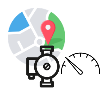

# Terminal Assets

A `TransactiveDevice` is a tuple of 3 physical things:

- **An electrical device** connected to the grid that can consume and/or produce electrical power;
- **An electrical meter** that meters exactly the `Terminal Asset` and has the accuracy characteristics required to meet existing and pending grid balancing challenges (that is, the challenge of keeping electric supply and electric demand in balance on various timescales as wind and solar electricity become more prevalent); and
- **A geographical location** of the location where the electrical device connects to the electric grid.

A `TerminalAsset` is a tuple of 3 things:

- **An electrical device** connected to the grid that can consume and/or produce electrical power;
- **An electrical meter** that meters exactly the `Terminal Asset` and has the accuracy characteristics required to meet existing and pending grid balancing challenges (that is, the challenge of keeping electric supply and electric demand in balance on various timescales as wind and solar electricity become more prevalent); and
- **A lat/lon pair** that can be used to capture where the electrical device is connected to the topology of the electric grid.

boundary between the physical world and the world of code, maintaining a high fidelity connection between Transactive Devices and _digital representations_ of these Transactive Devices as `TerminalAssets.`
In short, a `TerminalAsset` is a representation in code of a `TransactiveDevice` in the real world.

Here is the icon we use to represent `TerminalAssets`

